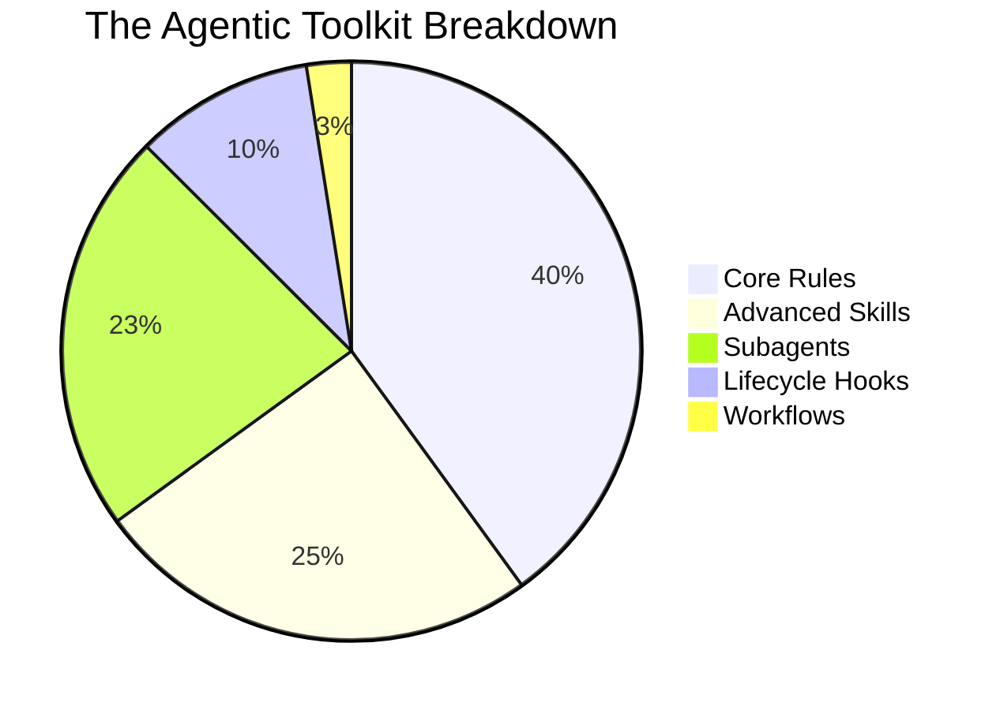

<p align="center">
  
</p>

<p align="center">
  <a href="https://github.com/FlameBLIZZard/better-agents"></a>
  <a href="#"></a>
  <a href="#"></a>
</p>

## 📜 The Agentic Manifesto

> Stop treating your AI like a glorified search engine. Treat it like a **Production Studio**.

*Better Agents* transforms your workspace into an autonomous ecosystem where you act as the **Creative Director**, and the AI handles the boilerplate. This is an ever-growing, limitless collection of modular rules, psychology-driven motivation loops, and autonomous subagents natively designed to protect your context window and maximize autonomous coding.

<p align="center">
  
</p>

---

## 🚀 How to Install (Universal CLI)

You don't need to manually clone or copy any folders! Just run our stunning interactive CLI directly from your terminal:

<p align="center">
  
</p>

```bash
npx github:FlameBLIZZard/better-agents
```

The wizard will magically compile your selected rules directly into your project for **Antigravity AI**, **Cursor**, **Windsurf**, or **Claude**.

---

## 🆚 The Showdown: Normal AI vs. Better Agents

| ❌ Normal Agent (The Pain) | ✨ Better Agents (The Solution) |
| :--- | :--- |
| **Apologizes endlessly** and dumps 400 lines of unformatted code into the chat. | **Stays silent**, auto-formats the code in the background, and just says *"Done."* |
| **Overwrites your working code** and breaks the app. | Uses the **"Time Machine"** hook to silently commit to Git *before* editing. |
| **Guesses your design preferences** and builds ugly UIs. | Spawns `@concept-artist` to generate 3 mockups for you to approve first. |
| **Blindly writes lazy Dockerfiles** that crash in production. | Uses the **Docker Workflow** to build the image locally and fix its own errors. |

---

## 🌟 The Agentic Production Studio

Why write code when you can direct? Meet your new specialized cast of AI subagents. 

### 🎨 `@concept-artist` (UI/UX Prototyper)
Generates structural wireframes and visual concepts prior to implementation.

### 🚀 `@autopilot` (Autonomous Developer)
Executes comprehensive implementation specs with zero human intervention.

### 🧽 `@silent-fixer` (Automated Debugger)
Analyzes stack traces and applies targeted patches without conversational overhead.

### 🏗️ `@system-architect` (Infrastructure Lead)
Designs and scaffolds highly scalable, strictly boundaried folder hierarchies.

### 🕵️ `@market-researcher` (Product Strategist)
Scours developer forums and internet communities for validated pain points before you write a single line of code.

### 📐 `@vector-artist` (Vector Graphics Engineer)
Mathematically plots and generates complex, scalable SVG illustrations and animations in pure code.

### 🎨 `@design-translator` (Design Systems Engineer)
Translates abstract design requirements into strict technical specifications.

### 🪄 `@documentation-engineer` (Documentation Engineer)
Synthesizes codebase context into comprehensive, production-ready documentation.

### ✨ `@ui-qa-engineer` (Frontend QA)
Enforces strict UI/UX consistency, spacing constraints, and component styling standards.

---

<!-- STATS:START -->
## 📊 The Arsenal (40 Modules & Counting)


<!-- STATS:END -->

---

## 📦 What Else is in the Box?

<details>
<summary><b>📜 Core Rules (Click to expand)</b></summary>
<br>

- 🗣️ **Interactive Planning**: Forces the agent to interview you (`/grill-me`) before scaffolding.
- 🕵️ **Dynamic User Profiler**: Analyzes your skill level and chat behavior to dynamically adjust its own tone and verbosity.
- 🎓 **Beginner Documentation**: Auto-generates a simple `PROJECT_TOUR.md` using real-world analogies.
- 📉 **Strict Token Conservation**: Strips AI filler and forces targeted edits to save context and money.
- 🧠 **Continuous Learning Protocol**: Forces the AI to document its mistakes in a Knowledge Base to prevent recurring errors.
- 🛤️ **The 3-Option Ideation**: Forbids unilateral decisions; the agent must present 3 distinct choices.
- 🧹 **Clean Desk Policy**: Automatically deletes temporary scratch files once a task is finished.
- 🚀 **GitHub Publish Ready**: Stops you from blindly pushing code and recommends an open-source audit first.

</details>

<details>
<summary><b>🧠 Motivation & Psychology Rules (Click to expand)</b></summary>
<br>

- 🔥 **The Hype Man**: Drops the robotic AI tone to aggressively hype you up after you fix a nasty bug or deploy.
- 🛑 **Anti-Burnout Protocol**: If you're stuck in a rut, the agent refuses to give you code and orders you to take a walk while it debugs in the background.
- 🎮 **RPG Gamification**: Awards you "+50 XP" and levels up your stats when you complete UI components or merge PRs.
- 🏆 **The Small Wins Tracker**: Interrupts you when you're overwhelmed to remind you of the amazing foundation you've already built today.

</details>

<details>
<summary><b>🪝 Invisible Lifecycle Hooks (Click to expand)</b></summary>
<br>

- ⏱️ **The "Time Machine" Auto-Save**: An invisible Node.js script that silently commits your code to Git after *every single AI step*. Hit undo anytime.
- 💅 **Auto-Formatter (Prettier)**: Formats your code behind the scenes *before* the AI touches it, preventing messy indentation errors.
- 💰 **Token Cost Tracker**: Injects a silent receipt estimating the cost of every step.

</details>

---

## 🌍 The Marketplace (Community Hub)

`better-agents` isn't just a toolkit; it's a global marketplace for developers to share their most powerful AI prompts.

Want to add your own custom `@seo-expert` subagent or an automated `database_migrator` skill? 
It is incredibly easy to contribute:

1. Head over to our **[Issues tab](https://github.com/FlameBLIZZard/better-agents/issues/new/choose)**.
2. Select **Submit a New Subagent** or **Submit a New Skill**.
3. Fill out the YAML form with your prompt.

Once merged, your agent will instantly become available to thousands of developers globally via the `npx github:FlameBLIZZard/better-agents` CLI installer! 

👉 Read the **[Full Contributing Guide](CONTRIBUTING.md)** to learn how to open a Pull Request and register your agent in the `registry.json`.

---

## 💎 Contributors Wall

A massive shoutout to the developers building the marketplace!

<a href="https://github.com/FlameBLIZZard/better-agents/graphs/contributors">
  
</a>
